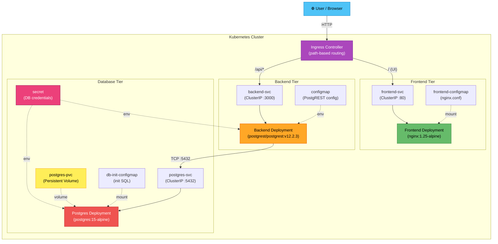

# 3-Tier Kubernetes Task Manager

A cloud-native task management application deployed on Kubernetes, demonstrating production-grade 3-tier architecture with **zero custom application code**. Uses pre-built DockerHub images exclusively — the entire project is pure Kubernetes manifests.

> [!NOTE]
> This project showcases real-world Kubernetes orchestration skills using battle-tested, off-the-shelf container images. No Dockerfiles, no custom builds — just infrastructure as code.

---

## Architecture



---

## Tech Stack

| Component  | Image                           | Purpose                                        |
| ---------- | ------------------------------- | ---------------------------------------------- |
| Frontend   | `nginx:1.25-alpine`             | Serves static UI & reverse-proxies API requests |
| Backend    | `postgrest/postgrest:v12.2.3`   | Auto-generates REST API from PostgreSQL schema  |
| Database   | `postgres:15-alpine`            | Relational database with persistent storage     |

---

## Prerequisites

| Tool                        | Required | Notes                                    |
| --------------------------- | -------- | ---------------------------------------- |
| Docker                      | ✅        | Container runtime (kind runs K8s in Docker) |
| kubectl                     | ✅        | Kubernetes CLI                           |
| kind                        | ✅        | Local Kubernetes cluster via Docker      |

---

## Quick Start

```bash
# 1. Create a kind cluster with port mappings for Ingress
kind create cluster --name taskmanager --config kind-config.yaml

# 2. Install the Nginx Ingress Controller for kind
kubectl apply -f https://raw.githubusercontent.com/kubernetes/ingress-nginx/main/deploy/static/provider/kind/deploy.yaml

# 3. Wait for the ingress controller to be ready
kubectl wait --namespace ingress-nginx \
  --for=condition=ready pod \
  --selector=app.kubernetes.io/component=controller \
  --timeout=120s

# 4. Deploy the entire stack in the correct order
bash deploy.sh

# 5. Access the app directly (kind maps port 80 to localhost)
#    → http://localhost
#
# Or use port-forward if port 80 is occupied:
#    kubectl port-forward svc/frontend-svc 8080:80 -n taskmanager
#    → http://localhost:8080
```

> [!TIP]
> The `deploy.sh` script handles **everything** automatically — cluster creation, ingress setup, and app deployment. Just run `bash deploy.sh` and it does it all!

---

## Project Structure

```
k8s-task-manager/
├── README.md                        # This file
├── deploy.sh                        # Automated deployment script
├── kind-config.yaml                 # Kind cluster config with port mappings
└── k8s/
    ├── namespace.yaml               # taskmanager namespace
    ├── secret.yaml                  # Database credentials (base64)
    ├── configmap.yaml               # PostgREST / app configuration
    ├── db-init-configmap.yaml       # SQL schema init script
    ├── postgres-pvc.yaml            # Persistent Volume Claim for DB
    ├── postgres-deployment.yaml     # PostgreSQL Deployment
    ├── postgres-service.yaml        # PostgreSQL ClusterIP Service
    ├── backend-deployment.yaml      # PostgREST Deployment
    ├── backend-service.yaml         # PostgREST ClusterIP Service
    ├── frontend-configmap.yaml      # Nginx reverse-proxy config + UI
    ├── frontend-deployment.yaml     # Nginx Frontend Deployment
    ├── frontend-service.yaml        # Frontend ClusterIP Service
    └── ingress.yaml                 # Ingress with path-based routing
```

---

## API Endpoints

PostgREST automatically generates a full REST API from the PostgreSQL schema. All endpoints are accessible under the `/api/` prefix.

### List All Tasks

```bash
curl http://localhost:8080/api/tasks
```

### Filter Tasks by Status

```bash
curl "http://localhost:8080/api/tasks?status=eq.pending"
```

### Create a Task

```bash
curl -X POST http://localhost:8080/api/tasks \
  -H "Content-Type: application/json" \
  -H "Prefer: return=representation" \
  -d '{"title": "Learn Kubernetes", "description": "Complete the K8s task manager project", "status": "pending"}'
```

### Update a Task

```bash
curl -X PATCH "http://localhost:8080/api/tasks?id=eq.1" \
  -H "Content-Type: application/json" \
  -H "Prefer: return=representation" \
  -d '{"status": "completed"}'
```

### Delete a Task

```bash
curl -X DELETE "http://localhost:8080/api/tasks?id=eq.1"
```

> [!IMPORTANT]
> The PostgREST API supports the full range of [PostgREST query syntax](https://postgrest.org/en/stable/references/api.html), including filtering, ordering, pagination, and bulk operations out of the box.

---

## Kubernetes Resources

| #  | Type         | Name                  | Purpose                                      |
| -- | ------------ | --------------------- | -------------------------------------------- |
| 1  | Namespace    | `taskmanager`          | Isolates all project resources                |
| 2  | Secret       | `db-secret`            | Stores database credentials (base64-encoded)  |
| 3  | ConfigMap    | `app-config`           | PostgREST and application configuration       |
| 4  | ConfigMap    | `db-init-config`       | SQL init script for schema & seed data        |
| 5  | ConfigMap    | `frontend-config`      | Nginx reverse-proxy configuration             |
| 6  | PVC          | `postgres-pvc`         | 1Gi persistent storage for PostgreSQL data    |
| 7  | Deployment   | `postgres`             | PostgreSQL 15 with health probes              |
| 8  | Service      | `postgres-svc`         | Internal ClusterIP for database access        |
| 9  | Deployment   | `backend`              | PostgREST auto-generated REST API             |
| 10 | Service      | `backend-svc`          | Internal ClusterIP for API access             |
| 11 | Deployment   | `frontend`             | Nginx serving UI + reverse proxy              |
| 12 | Service      | `frontend-svc`         | Internal ClusterIP for frontend access        |
| 13 | Ingress      | `taskmanager-ingress`  | Path-based routing (`/` → UI, `/api` → API)  |

---

## Cleanup

Remove all resources by deleting the namespace:

```bash
kubectl delete namespace taskmanager
```

Or use the deploy script:

```bash
# Remove app resources only (keeps the cluster)
bash deploy.sh --cleanup

# Delete the entire kind cluster
bash deploy.sh --destroy
# or
kind delete cluster --name taskmanager
```

---

## Skills Demonstrated

- **3-Tier Microservices Architecture** — Frontend, Backend API, and Database as independently deployable units
- **Kubernetes Orchestration** — Deployments, Services, Ingress, and Namespaces
- **Configuration Management** — Externalized config via ConfigMaps and Secrets
- **Persistent Storage** — PersistentVolumeClaims for stateful database workloads
- **Service Discovery & Internal Networking** — DNS-based inter-service communication
- **Ingress & Path-based Routing** — Single entry point with intelligent request routing
- **Health Probes (Liveness / Readiness)** — Automated pod health management
- **Resource Management** — CPU and memory requests/limits for every container
- **Infrastructure as Code** — Entire stack defined as declarative YAML manifests
- **12-Factor App Principles** — Config in environment, stateless processes, port binding

---

## License

This project is open source and available under the [MIT License](LICENSE).
