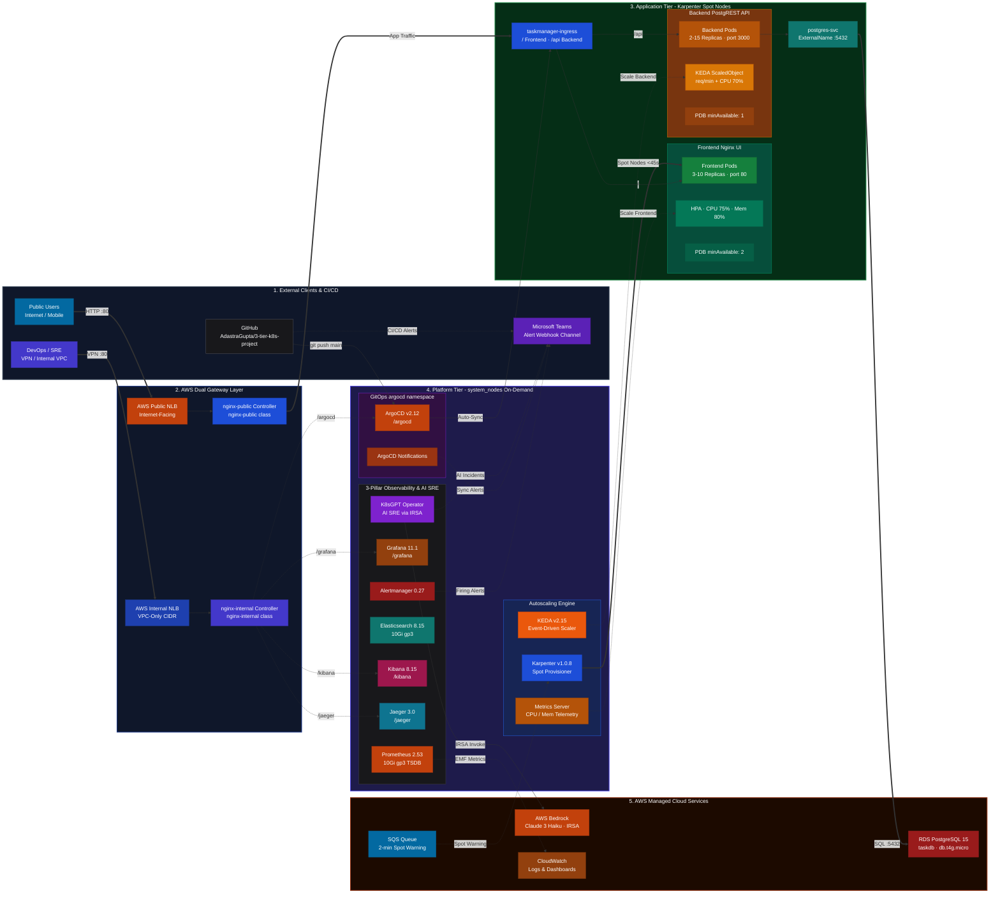
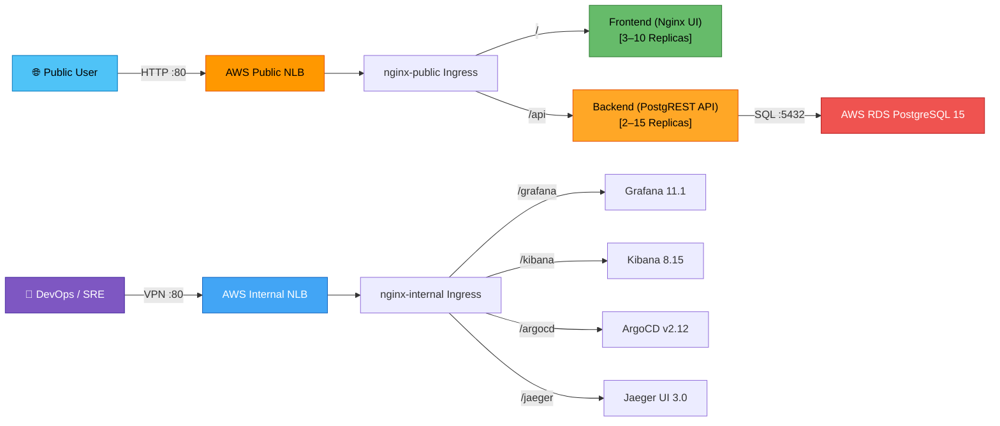
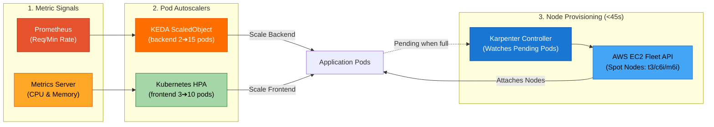
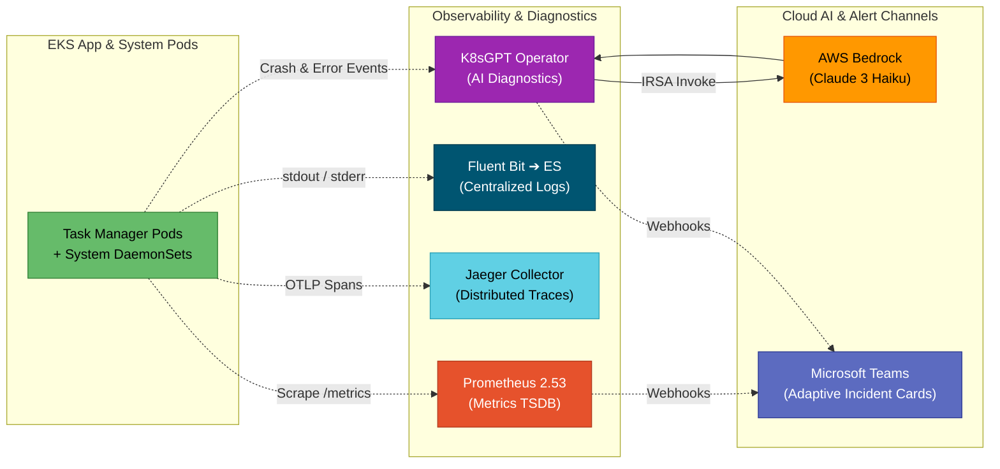

# 3-Tier Task Manager — AWS EKS + GitOps

A production-grade, cloud-native **3-tier task manager** application deployed on **AWS EKS** with a fully automated **GitOps** pipeline using ArgoCD.

## Architecture

### System Architecture Overview

The system is structured into **4 decoupled, secure tiers**: External Ingress & GitOps, Application Workloads (Karpenter Spot), Platform & Observability (On-Demand System Nodes), and AWS Managed Services.



### Detailed Domain Workflows

To make each subsystem easy to navigate, here are the **3 isolated data-flow diagrams**:

#### 🌐 1. Application & Dual Ingress Traffic Flow


#### ⚡ 2. Full-Stack Autoscaling & Node Provisioning Flow


#### 🔭 3. Observability, AI SRE & GitOps Alerting Flow


---

### Architecture Highlights

1. **Dual Ingress Segmentation & Cross-Namespace `ExternalName` Proxies:**
   - **Public NLB (`nginx-public`)**: Internet-facing load balancer serving the Frontend UI (`/`) and PostgREST backend API (`/api`).
   - **Internal NLB (`nginx-internal`)**: Private VPC load balancer serving **Grafana** (`/grafana`), **Kibana** (`/kibana`), **ArgoCD** (`/argocd`), and **Jaeger** (`/jaeger`).
   - **Cross-Namespace ExternalName Services**: Ingress rules in `ingress-nginx` route through dedicated `ExternalName` proxy services (`grafana-external`, `kibana-external`, `argocd-external`, `jaeger-external`) that resolve target service FQDNs across namespaces (`monitoring`, `logging`, `argocd`, `tracing`).
2. **EKS Core Add-ons & Dynamic `gp3` Storage Layer:**
   - **AWS-Managed Add-ons**: `vpc-cni` (direct VPC IP allocation per pod), `coredns` (cluster DNS discovery), `kube-proxy` (node networking), and `aws-ebs-csi-driver` (dynamic storage provisioner).
   - **StorageClass (`gp3`)**: Configured with `volume_binding_mode = "WaitForFirstConsumer"` to ensure EBS volumes are created in the exact Availability Zone of the scheduled pod, with `allow_volume_expansion = true` and `reclaim_policy = "Retain"`. Powers persistent storage for **Elasticsearch (`10Gi`)**, **Prometheus TSDB (`10Gi`)**, and **Alertmanager (`5Gi`)**.
3. **Automated GitOps Engine (ArgoCD via Helm):**
   - Fully provisioned by Terraform. Automatically synchronizes `k8s/` manifests from GitHub into the `taskmanager` namespace with self-healing and auto-pruning.
4. **Triple-Layer Alerting System (Microsoft Teams Webhook):**
   - **CI/CD Pipeline Alerts**: GitHub Actions emits Rich Adaptive Cards for Terraform Plan, Apply, and Destroy events.
   - **GitOps Alerts**: ArgoCD Notifications publishes real-time sync success, sync failure, and health degradation cards.
   - **Infrastructure / Metric Alerts**: Alertmanager routes Prometheus alert rule evaluations (pod crashes, replica mismatches, node pressure) directly to Teams.
5. **Complete 3-Pillar Observability Stack (Metrics, Logs, Traces):**
   - **Metrics (Prometheus & Grafana)**: Time-series metrics across nodes, Kubernetes objects, and PostgREST endpoints with persistent EBS `gp3` TSDB storage.
   - **Logs (EFK Stack)**: Distributed log aggregation via Fluent Bit DaemonSets into Elasticsearch with visualization in Kibana.
   - **Traces (Jaeger)**: End-to-end distributed tracing via three distinct workloads — **Jaeger Collector** (`Deployment`, ingests OTLP spans on ports 4317/4318), **Jaeger Query UI** (`Deployment`, serves the `/jaeger` dashboard at port 16686), and **Jaeger Agent** (`DaemonSet`, per-node batcher routing spans to the Collector). All traces are persisted in Elasticsearch (not in Jaeger itself), so Jaeger components are fully stateless and do NOT require PersistentVolumes.
   - **AWS CloudWatch Container Insights**: Embedded Metric Format (EMF) scraping for cloud-native metrics and alarms.
6. **AI-Powered SRE Automation (K8sGPT + AWS Bedrock):**
   - Autonomous Kubernetes failure detection across pods, deployments, services, ingress, PVCs, and nodes.
   - Leverages **AWS Bedrock (Anthropic Claude 3 Haiku)** via **IAM Roles for Service Accounts (IRSA)** for passwordless, zero-secret authentication, delivering plain-English root causes and remediation `kubectl` commands directly to Microsoft Teams.
7. **Dual Managed Node Groups (Workload Isolation & Spot Cost Optimization):**
   - **`system_nodes`** (`ON_DEMAND`, 2× `t3.medium`): High-reliability node group hosting Ingress controllers, ArgoCD, Prometheus, Grafana, Alertmanager, Elasticsearch, Kibana, Jaeger, K8sGPT Operator, KEDA Controller, and the Karpenter controller itself.
   - **`app_nodes` → Karpenter `NodePool`**: Cost-optimized dynamic compute pool for `taskmanager` application workloads. Karpenter provisions right-sized Spot instances (with On-Demand fallback) from families `t3`, `t3a`, `c6i`, `m6i` within 45 seconds when pods become `Pending`; auto-consolidates and terminates idle nodes.
8. **Full-Stack Autoscaling Engine (KEDA + HPA + Karpenter):**
   - **Pod-Level — KEDA (Event-Driven)**: `ScaledObject` on the backend drives HPA scaling from **2 → 15 replicas** based on dual triggers: Prometheus PostgREST request rate (`> 50 req/min per pod`) and CPU utilization (`> 70%`).
   - **Pod-Level — HPA (Resource-Based)**: Standard Kubernetes HPA scales frontend from **3 → 10 replicas** on CPU (`> 75%`) and Memory (`> 80%`); powered by Kubernetes Metrics Server.
   - **Node-Level — Karpenter**: Automatically provisions EC2 Spot/On-Demand nodes from AWS EC2 Fleet API in **< 45 seconds** when scaling pods are `Pending`. Handles Spot interruption warnings (2-minute SQS/EventBridge signal) with graceful node draining. Consolidates underutilized nodes after 30 seconds idle.
   - **Resilience — PodDisruptionBudgets (PDBs)**: Guarantee `minAvailable: 2` for frontend and `minAvailable: 1` for backend during any Karpenter node consolidation or EC2 reclaim, ensuring zero user-facing downtime.

## Tech Stack

| Layer | Technology |
|---|---|
| **Container Orchestration** | AWS EKS 1.30 (`system_nodes` [ON_DEMAND `t3.medium`] + Karpenter Dynamic NodePool [Spot `t3/c6i/m6i`]) |
| **EKS Managed Add-ons** | `vpc-cni`, `coredns`, `kube-proxy`, `aws-ebs-csi-driver` |
| **Persistent Storage** | Kubernetes `gp3` StorageClass (`WaitForFirstConsumer`, EBS CSI provisioner) |
| **Frontend** | Nginx serving static HTML/CSS/JS |
| **Backend API** | [PostgREST](https://postgrest.org/) v12.2.3 — auto-generates REST API from PostgreSQL schema |
| **Database** | AWS RDS PostgreSQL 15 (`db.t4g.micro`, Single-AZ) |
| **GitOps** | ArgoCD v2.12 — Helm-managed, fully automated via `terraform apply` |
| **CI/CD** | GitHub Actions — Terraform plan/apply pipeline with OIDC authentication |
| **Ingress** | Dual Nginx Ingress Controllers — `nginx-public` (internet) + `nginx-internal` (VPC-only) |
| **Event-Driven Pod Autoscaling** | KEDA v2.15 — Prometheus request-rate + CPU triggers on backend (`ScaledObject`, min:2 → max:15) |
| **Resource-Based Pod Autoscaling** | Kubernetes HPA v2 — CPU/Memory triggers on frontend (min:3 → max:10) via Metrics Server |
| **Node Autoscaling** | Karpenter v1.0.8 — just-in-time EC2 Spot/On-Demand provisioning (< 45s), Spot interruption via SQS + EventBridge, node consolidation |
| **Resilience** | PodDisruptionBudgets — `minAvailable: 2` (frontend) + `minAvailable: 1` (backend) |
| **Metrics & Monitoring** | Prometheus 2.53 + Grafana 11.1 via `kube-prometheus-stack` (Helm-managed) |
| **Distributed Tracing** | Jaeger 3.0 via `jaegertracing/jaeger` — Collector, Query UI, Agent (`DaemonSet`); traces stored in Elasticsearch |
| **Alerting** | Alertmanager (MS Teams webhook routing) + AWS CloudWatch Alarms |
| **Observability (AWS)** | AWS CloudWatch (Dashboard + Container Insights + Metric Alarms) |
| **Centralized Logging** | EFK Stack — Elasticsearch 8.15, Fluent Bit 3.1, Kibana 8.15 (Helm-managed via Terraform) |
| **AI SRE / AIOps** | K8sGPT Operator 0.2.2 + AWS Bedrock (Anthropic Claude 3 Haiku via IRSA) |
| **Infrastructure as Code** | Terraform (S3 backend + DynamoDB state locking) |


## Project Structure

```
├── k8s/                              # Kubernetes manifests (synced by ArgoCD)
│   ├── namespace.yaml                # taskmanager namespace
│   ├── secret.yaml                   # App secrets (RDS credentials, PGRST_DB_URI)
│   ├── configmap.yaml                # PostgREST configuration (schema, anon role)
│   ├── frontend-configmap.yaml       # Frontend HTML/CSS/JS (served via Nginx)
│   ├── frontend-deployment.yaml
│   ├── frontend-service.yaml         # type: ClusterIP — traffic enters via nginx Ingress only
│   ├── frontend-hpa.yaml             # HPA: CPU 75% + Memory 80% → scales frontend 3→10 pods
│   ├── backend-deployment.yaml       # PostgREST deployment
│   ├── backend-service.yaml          # type: ClusterIP
│   ├── backend-scaledobject.yaml     # KEDA ScaledObject: Prometheus req/min + CPU → scales backend 2→15 pods
│   ├── pdb.yaml                      # PodDisruptionBudgets (frontend minAvail:2 + backend minAvail:1)
│   ├── postgres-service.yaml         # type: ExternalName → AWS RDS endpoint
│   ├── karpenter-nodepool.yaml       # Karpenter EC2NodeClass + NodePool (Spot→On-Demand, auto-consolidation)
│   ├── ingress.yaml                  # Public Ingress (nginx-public: / → frontend, /api → backend)
│   └── ingress-internal.yaml         # Internal Ingress (nginx-internal: /grafana, /kibana, /argocd, /jaeger)
│
└── terraform/                        # Infrastructure as Code
    ├── provider.tf                   # AWS + Kubernetes + Helm + Random provider config
    ├── variables.tf                  # All configurable inputs (EFK, Monitoring, ArgoCD, Tracing, Karpenter, KEDA vars)
    ├── vpc.tf                        # VPC, public/private subnets, NAT Gateway
    ├── eks.tf                        # EKS cluster + system_nodes (ON_DEMAND) + EBS CSI IRSA
    ├── rds.tf                        # RDS PostgreSQL instance + subnet/security groups
    ├── cloudwatch.tf                 # CloudWatch Log Groups, Dashboard, Metric Alarms
    ├── ingress.tf                    # Dual Nginx Ingress Controllers (nginx-public + nginx-internal)
    ├── efk.tf                        # EFK logging stack (Helm: ES + Fluent Bit + Kibana)
    ├── monitoring.tf                 # Prometheus + Grafana stack (Helm: kube-prometheus-stack)
    ├── tracing.tf                    # Jaeger distributed tracing stack (Helm: jaegertracing/jaeger)
    ├── argocd.tf                     # ArgoCD GitOps controller (Helm: argo/argo-cd)
    ├── k8sgpt.tf                     # K8sGPT Operator (AI-powered SRE via AWS Bedrock + IRSA)
    ├── karpenter.tf                  # Karpenter: IRSA + Node IAM Role + SQS queue + EventBridge + Helm
    ├── keda.tf                       # KEDA Controller + Kubernetes Metrics Server (Helm)
    └── outputs.tf                    # Key outputs (endpoints, commands, passwords)
├── .github/
│   └── workflows/
│       └── terraform.yml             # CI/CD: plan on PR, auto-apply on push to main
```

## Prerequisites

- AWS CLI configured with appropriate credentials (`aws configure`)
- [Terraform](https://developer.hashicorp.com/terraform/install) >= 1.5
- [kubectl](https://kubernetes.io/docs/tasks/tools/)
- [Helm](https://helm.sh/docs/intro/install/)

## Quick Start

### 1. Deploy Infrastructure

```bash
cd terraform
terraform init
terraform apply
```

This provisions:
- EKS cluster (`taskmanager-cluster`) with **On-Demand System Node Group** + **Karpenter Just-in-Time Spot NodePool**
- AWS RDS PostgreSQL 15 (`db.t4g.micro`)
- VPC with public/private subnets across 2 AZs
- CloudWatch Dashboard + Metric Alarms + Container Insights
- **EFK Logging Stack** via Helm (Elasticsearch 8.15, Fluent Bit 3.1, Kibana 8.15)
- **Prometheus + Grafana + Alertmanager Monitoring Stack** via Helm
- **Jaeger Distributed Tracing Stack** via Helm (connected to Elasticsearch backend)
- **K8sGPT Operator** with AWS Bedrock AI incident analysis
- **KEDA + Kubernetes Metrics Server + Karpenter** full-stack autoscaling engine

### 2. Configure kubectl

```bash
aws eks update-kubeconfig --region us-east-1 --name taskmanager-cluster
```

### 3. Update RDS Endpoint in postgres-service.yaml

After `terraform apply`, update the `externalName` in [k8s/postgres-service.yaml](k8s/postgres-service.yaml) with the actual RDS endpoint:

```bash
# Get the RDS address
terraform output rds_address

# Or patch it directly
terraform output rds_k8s_external_service_command | bash
```

### 4. Update k8s/secret.yaml with RDS Credentials

Encode your RDS credentials in base64 and update [k8s/secret.yaml](k8s/secret.yaml):

```bash
# Example
echo -n "postgres://postgres:<PASSWORD>@<RDS_HOST>:5432/taskdb?sslmode=require" | base64
```

### 5. Initialize the Database Schema

Run a one-off pod to create the `tasks` table and `web_anon` role on RDS:

```bash
kubectl run rds-init -n taskmanager --image=postgres:15-alpine --rm -i --restart=Never -- \
  psql "postgres://postgres:<PASSWORD>@<RDS_HOST>:5432/taskdb?sslmode=require" -c "
    CREATE ROLE web_anon NOLOGIN;
    GRANT USAGE ON SCHEMA public TO web_anon;
    CREATE TABLE IF NOT EXISTS tasks (
      id SERIAL PRIMARY KEY,
      title VARCHAR(255) NOT NULL,
      description TEXT,
      status VARCHAR(50) NOT NULL DEFAULT 'pending',
      created_at TIMESTAMPTZ DEFAULT NOW(),
      updated_at TIMESTAMPTZ DEFAULT NOW()
    );
    GRANT ALL ON TABLE tasks TO web_anon;
    GRANT USAGE, SELECT ON ALL SEQUENCES IN SCHEMA public TO web_anon;"
```

### 6. ArgoCD (GitOps) & MS Teams Alerts

ArgoCD is **100% automated via Helm** (`terraform/argocd.tf`). When `terraform apply` completes:
1. ArgoCD Server & Controllers are running in the `argocd` namespace.
2. MS Teams notifications are configured and subscribed to sync events.
3. The `taskmanager` Application is auto-created and syncing the `k8s/` directory.

**Get the auto-generated admin password:**
```bash
kubectl -n argocd get secret argocd-initial-admin-secret -o jsonpath="{.data.password}" | base64 -d
```

**Access the ArgoCD UI:**
```bash
# Option A: Via Internal Ingress Controller port-forward
kubectl port-forward svc/nginx-internal-ingress-nginx-controller 8080:80 -n ingress-nginx
# Open http://localhost:8080/argocd (username: admin)

# Option B: Direct port-forward
kubectl port-forward svc/argocd-server 8080:80 -n argocd
# Open http://localhost:8080 (username: admin)
```

### 7. Push Changes to GitHub to Sync

Any changes committed and pushed to the `k8s/` directory on the `main` branch will be **automatically synced** by ArgoCD within ~3 minutes and send a notification card directly to Microsoft Teams.

## Accessing the Application

### Frontend Web UI & API (via Public Ingress NLB)

```bash
# Get the Public Ingress Controller's external NLB hostname
kubectl get svc nginx-public-ingress-nginx-controller -n ingress-nginx \
  -o jsonpath='{.status.loadBalancer.ingress[0].hostname}'
# Use the EXTERNAL-IP once AWS provisions the Load Balancer (~2 min)
```

- **Frontend Web UI**: `http://<PUBLIC-NLB-HOSTNAME>/`
- **Backend REST API**: `http://<PUBLIC-NLB-HOSTNAME>/api/tasks`

### Port-Forward (Local Development)

```bash
# Frontend
kubectl port-forward svc/frontend-svc 8080:80 -n taskmanager
# Open http://localhost:8080

# Backend REST API
kubectl port-forward svc/backend-svc 3000:3000 -n taskmanager
# Open http://localhost:3000/tasks
```

## Key Design Decisions

| Decision | Rationale |
|---|---|
| **PostgREST as Backend** | Auto-generates a full REST API from PostgreSQL schema — zero backend code to maintain |
| **AWS RDS (not in-cluster Postgres)** | Managed, automated backups, Multi-AZ failover capability, separate lifecycle from EKS |
| **ExternalName Service for RDS** | Backend pods connect via `postgres-svc:5432` — no hardcoded DNS, easy to swap |
| **Dual Nginx Ingress Controllers** | `nginx-public` (internet-facing NLB) separates public app traffic from `nginx-internal` (VPC-only NLB) which serves admin tools — zero attack surface on Grafana, Kibana, ArgoCD |
| **Native K8s Ingress (no Istio)** | Eliminates sidecar overhead (~100–150 MB RAM/CPU per pod), removes webhook deadlock risk |
| **ExternalName proxy pattern** | `ingress-internal.yaml` uses `ExternalName` services in the `ingress-nginx` namespace to reach ClusterIP services across namespaces (`monitoring`, `logging`, `argocd`) without exposing them |
| **ArgoCD via Helm (not raw YAML)** | Zero manual `kubectl apply` steps — MS Teams notifications, app provisioning and namespace creation all automated via `terraform apply` |
| **`sslmode=require` in DB URI** | AWS RDS enforces TLS by default; this ensures encrypted connections from PostgREST |
| **Dual Managed Node Groups** | `system_nodes` (`ON_DEMAND` `t3.medium`) for core infra/observability + `app_nodes` (`SPOT` `t3.small`) for stateless app workloads saves ~70% on compute |
| **EFK via Helm (not raw YAML)** | Official Helm charts (elastic/elasticsearch, fluent/fluent-bit, elastic/kibana) — production-grade with upgradeable chart versions, parameterized via Terraform variables |

## CloudWatch Observability

After deployment, a **CloudWatch Dashboard** is automatically provisioned at:

```bash
terraform output cloudwatch_dashboard_url
```

The dashboard shows:
- **PostgREST API request rate** (Prometheus metrics from `/metrics`)
- **RDS CPU Utilization + DB Connections**
- **EKS Pod CPU & Memory** (Container Insights)

**Metric Alarms** are configured for:
- RDS CPU > 80% for 5 minutes
- RDS Free Storage < 2 GB

## EFK Centralized Logging

The project includes a full **EFK stack** (Elasticsearch, Fluent Bit, Kibana) for centralized log aggregation, search, and visualization — deployed via **official Helm charts** managed by Terraform.

### Architecture

```
┌──────────────┐     ┌──────────────┐     ┌──────────────┐
│  Frontend    │     │  Backend     │     │  System Pods │
│  (nginx)     │     │  (PostgREST) │     │  (kube-*, ..)│
│  stdout/err  │     │  stdout/err  │     │  stdout/err  │
└──────┬───────┘     └──────┬───────┘     └──────┬───────┘
       │                    │                    │
       └────────────┬───────┘────────────────────┘
                    │
         ┌──────────▼──────────┐
         │    Fluent Bit 3.1   │  ← Helm: fluent/fluent-bit
         │  /var/log/containers│  ← DaemonSet (1 per node)
         │  + K8s metadata     │  ← Enriches with pod/ns/labels
         └──────────┬──────────┘
                    │ HTTP bulk insert
         ┌──────────▼──────────┐
         │  Elasticsearch 8.15 │  ← Helm: elastic/elasticsearch
         │  Index: fluent-bit-*│  ← StatefulSet (10Gi EBS gp3)
         └──────────┬──────────┘
                    │ Query API
         ┌──────────▼──────────┐
         │    Kibana 8.15      │  ← Helm: elastic/kibana
         │  ClusterIP (:5601)  │  ← Routed via /kibana on Internal Ingress
         └─────────────────────┘
```

### Helm Charts Used

| Component | Chart | Repository | Image Tag |
|---|---|---|---|
| **Elasticsearch** | `elastic/elasticsearch` v8.5.1 | `https://helm.elastic.co` | `8.15.0` |
| **Fluent Bit** | `fluent/fluent-bit` v0.47.10 | `https://fluent.github.io/helm-charts` | latest |
| **Kibana** | `elastic/kibana` v8.5.1 | `https://helm.elastic.co` | `8.15.0` |

### Deployment

The EFK stack is **automatically deployed** by Terraform via `helm_release` resources in [`efk.tf`](terraform/efk.tf):

```bash
cd terraform
terraform init    # Downloads Helm chart providers
terraform apply   # Deploys EFK stack along with all other infrastructure
```

Verify the deployment:
```bash
# Check Helm releases
helm list -n logging

# Wait for all EFK pods to be Running
kubectl get pods -n logging -w

# Check Elasticsearch cluster health
kubectl exec -n logging elasticsearch-master-0 -- curl -s http://localhost:9200/_cluster/health?pretty
```

To **disable** the EFK stack without removing it from code:
```bash
terraform apply -var="efk_enabled=false"
```

### Access Kibana

Kibana is exposed as a **ClusterIP service** and routed via the **Internal Ingress NLB** at `/kibana`:

```bash
# Option A: Via Internal Ingress Controller port-forward
kubectl port-forward svc/nginx-internal-ingress-nginx-controller 8080:80 -n ingress-nginx
# Open http://localhost:8080/kibana in your browser

# Option B: Direct port-forward
kubectl port-forward svc/kibana-kibana 5601:5601 -n logging
# Open http://localhost:5601
```

### First-Time Kibana Setup

1. Open Kibana in your browser
2. Go to **Stack Management** → **Data Views** (or Index Patterns)
3. Create a new data view with pattern: `fluent-bit-*`
4. Set the time field to `@timestamp`
5. Navigate to **Discover** to explore logs
6. Use KQL queries to filter:
   - `kubernetes.namespace_name: "taskmanager"` — app logs only
   - `kubernetes.labels.tier: "backend"` — PostgREST logs
   - `kubernetes.labels.tier: "frontend"` — nginx access logs
   - `kubernetes.pod_name: "backend-*" AND log: "error"` — backend errors

### Log Retention

Elasticsearch indices follow the pattern `fluent-bit-YYYY.MM.DD` (daily rotation). To manage storage:

```bash
# List all indices and their sizes
kubectl exec -n logging elasticsearch-master-0 -- curl -s 'http://localhost:9200/_cat/indices/fluent-bit-*?v&s=index'

# Delete indices older than 7 days
kubectl exec -n logging elasticsearch-master-0 -- curl -s -X DELETE 'http://localhost:9200/fluent-bit-2024.01.0*'
```

### Helm Upgrade

To upgrade chart versions, update the `version` and `imageTag` in [`efk.tf`](terraform/efk.tf) and re-apply:
```bash
terraform apply   # Helm handles rolling update automatically
```

> [!NOTE]
> For automated index lifecycle management (ILM), configure an ILM policy in Kibana under **Stack Management → Index Lifecycle Policies**.

## Prometheus & Grafana Monitoring

The cluster includes a production-ready **Prometheus + Grafana + Alertmanager** stack deployed via the official `kube-prometheus-stack` Helm chart ([`terraform/monitoring.tf`](terraform/monitoring.tf)).

### Architecture & Components

```
┌─────────────────────────────────────────────────────────────────────────────────┐
│                        KUBE-PROMETHEUS-STACK (monitoring)                       │
├───────────────────┬───────────────────┬───────────────────┬─────────────────────┤
│   Node Exporter   │ kube-state-metrics│  Prometheus TSDB  │       Grafana       │
│  (Host Hardware)  │ (K8s Deployments) │ (EBS gp3 Storage) │ (ClusterIP :80)     │
└─────────┬─────────┴─────────┬─────────┴─────────┬─────────┴──────────┬──────────┘
          │                   │                   │                    │
          └───────────────────┼───────────────────┘                    │
                              ▼ scrapes                                ▼ /grafana path
                  ┌───────────────────────┐                 ┌───────────────────────┐
                  │      Alertmanager     │                 │   Pre-built EKS &     │
                  │ (MS Teams Webhook)    │                 │ Workload Dashboards   │
                  └───────────────────────┘                 └───────────────────────┘
```

| Component | Role | Chart / Version |
|---|---|---|
| **Prometheus Operator** | Manages CRDs (`ServiceMonitor`, `PodMonitor`, `PrometheusRule`) | `kube-prometheus-stack` 61.3.1 |
| **Prometheus Server** | Scrapes metrics from nodes, pods, and PostgREST API (TSDB on 10Gi gp3) | Prometheus 2.53 |
| **Alertmanager** | Groups, deduplicates, and routes alerts to **Microsoft Teams** | Alertmanager 0.27 |
| **Grafana** | Visual dashboards (pre-loaded with Kubernetes Cluster & Workload boards) | Grafana 11.1 |
| **node-exporter** | Gathers node-level CPU, memory, network, and disk I/O metrics | DaemonSet on every node |
| **kube-state-metrics** | Exports Kubernetes resource state (pod counts, replica status, node health) | Deployment in `monitoring` |

### Accessing Grafana

#### 1. Retrieve the Auto-Generated Admin Password
Terraform generates a cryptographically random 16-character password during deployment:

```bash
cd terraform
terraform output -raw grafana_admin_password
```

#### 2. Access the Grafana Dashboard
Grafana is exposed as a **ClusterIP service** and routed via the **Internal Ingress NLB** at `/grafana`:

```bash
# Option A: Via Internal Ingress Controller port-forward
kubectl port-forward svc/nginx-internal-ingress-nginx-controller 8080:80 -n ingress-nginx
# Open http://localhost:8080/grafana (User: admin)

# Option B: Direct port-forward
kubectl port-forward svc/kube-prometheus-stack-grafana 3001:80 -n monitoring
# Open http://localhost:3001 (User: admin)
```

### Pre-Built Dashboards Available in Grafana

Once logged in, navigate to **Dashboards** to view pre-loaded boards:
* **Kubernetes / Compute Resources / Cluster** — Total cluster CPU, memory, and pod capacity
* **Kubernetes / Compute Resources / Namespace (Workloads)** — CPU & memory per deployment in `taskmanager`
* **Kubernetes / Compute Resources / Node (Pods)** — Pod density and resource allocation per EKS node
* **Node Exporter / Use Method / Node** — Hardware-level disk I/O, load average, and network throughput

### Alertmanager → Microsoft Teams Routing

Alertmanager is configured to automatically route firing alerts to your Microsoft Teams channel when `teams_webhook_url` is provided in Terraform or GitHub Secrets.

Alerts include:
- `KubePodCrashLooping` — Pod failing and restarting repeatedly
- `KubeNodeNotReady` — EKS worker node experiencing hardware / network failure
- `KubeMemoryQuotaOvercommit` — Cluster running out of memory headroom
- `PostgresBackendDown` — PostgREST backend metrics endpoint unreachable

## K8sGPT — AI-Powered SRE with AWS Bedrock

The **K8sGPT Operator** is deployed into the EKS cluster and acts as an automated Site Reliability Engineer (SRE). It continuously scans all Kubernetes objects, sends failure context to **AWS Bedrock (Anthropic Claude 3 Haiku)**, and returns plain-English root-cause diagnoses with exact remediation commands — eliminating the need to manually parse cryptic `kubectl describe` output.

### How It Works

```
+-----------------------------------------------------------+
|                     Amazon EKS Cluster                    |
|                                                           |
|   Failing Pod (CrashLoopBackOff / OOMKilled)              |
|        │                                                  |
|        ▼                                                  |
|   K8sGPT Operator (k8sgpt namespace)                      |
|   - Collects pod events + error logs                      |
|   - Anonymizes sensitive data (IPs, names, env values)    |
|   - Calls AWS Bedrock via OIDC/IRSA (zero secrets)        |
+----------------------│------------------------------------+
                       │  bedrock:InvokeModel
                       ▼
             AWS Bedrock (Claude 3 Haiku)
             - Analyzes Kubernetes error context
             - Returns root cause + kubectl fix
                       │
          ┌────────────┴───────────────┐
          ▼                            ▼
   kubectl get results         Microsoft Teams
   -n k8sgpt -o yaml           (Incident alert card)
```

### Authentication (Zero Secrets via IRSA)

K8sGPT authenticates to AWS Bedrock using **IAM Roles for Service Accounts (IRSA)** — the same mechanism used by the EBS CSI Driver. No API keys are stored anywhere:

- `aws_iam_policy.k8sgpt_bedrock` — Grants `bedrock:InvokeModel` for Claude 3 Haiku/Sonnet only
- `module.k8sgpt_irsa_role` — Binds the IAM role to the `k8sgpt:k8sgpt-operator` ServiceAccount via OIDC

### Configuration

Controlled via Terraform variables in `terraform/variables.tf`:

| Variable | Default | Description |
|---|---|---|
| `k8sgpt_enabled` | `true` | Enable/disable the K8sGPT Operator |
| `k8sgpt_bedrock_model` | `anthropic.claude-3-haiku-20240307-v1:0` | Bedrock model for analysis (Haiku = fast & cheap) |
| `k8sgpt_anonymize` | `true` | Mask sensitive data before sending to Bedrock |

### Objects Monitored

| Kubernetes Object | What K8sGPT Detects |
|---|---|
| **Pod** | `CrashLoopBackOff`, `OOMKilled`, `ImagePullBackOff` |
| **Deployment** | Unavailable replicas, rollout stuck |
| **Service** | Missing endpoints, wrong label selectors |
| **Ingress** | Invalid backend service references, TLS issues |
| **PersistentVolumeClaim** | Unbound PVCs, EBS provisioning failures |
| **Node** | `NotReady` state, disk pressure, memory pressure |

### Operational Commands

```bash
# Check K8sGPT Operator pod health
kubectl get pods,k8sgpt,results -n k8sgpt

# View all AI-generated incident diagnoses
kubectl get results -n k8sgpt -o yaml

# Or via Terraform outputs after apply
terraform output k8sgpt_status_command
terraform output k8sgpt_results_command
terraform output k8sgpt_bedrock_model
```

### Example AI Output

When K8sGPT detects a failing pod, it creates a `Result` Custom Resource like:

```yaml
apiVersion: core.k8sgpt.ai/v1alpha1
kind: Result
metadata:
  name: taskmanager-backend-crashloop
  namespace: k8sgpt
status:
  details: |
    Problem: The PostgREST backend pod is crash-looping because it cannot
    authenticate to RDS PostgreSQL at taskmanager-cluster-postgres...:5432.

    Root Cause: FATAL: password authentication failed for user postgres.
    The PGRST_DB_URI in Kubernetes Secret 'app-secret' does not match the
    RDS master password.

    Fix:
    kubectl create secret generic app-secret \
      --from-literal=PGRST_DB_URI='postgres://postgres:<CORRECT_PASSWORD>@<RDS_HOST>:5432/taskdb' \
      -n taskmanager --dry-run=client -o yaml | kubectl apply -f -
    kubectl rollout restart deployment backend -n taskmanager
```

> [!IMPORTANT]
> **AWS Bedrock Model Access Required (One-Time Setup):**
> Navigate to **AWS Console → Amazon Bedrock → Model Access → Request Access** and enable **Anthropic Claude 3 Haiku** before running `terraform apply`.

## Full-Stack Autoscaling (KEDA + HPA + Karpenter)

The cluster implements a 3-layer, synergistic autoscaling pipeline combining **event-driven pod scaling (KEDA)**, **resource-based pod scaling (HPA)**, and **just-in-time node provisioning (Karpenter)**.

### Autoscaling Lifecycle

```
                     TRAFFIC SURGE (e.g. 5,000 HTTP req/min)
                                        │
                                        ▼
  ┌───────────────────────────────────────────────────────────────────────────┐
  │ 1. POD AUTOSCALING TIER (KEDA + HPA)                                      │
  │ • Prometheus records request rate spike on /metrics                       │
  │ • KEDA ScaledObject evaluates: rate > 50 req/min/pod                      │
  │ • HPA scales backend from 2 ➔ 15 replicas                                 │
  │ • Frontend HPA scales from 3 ➔ 10 replicas on CPU/Memory                  │
  └─────────────────────────────────────┬─────────────────────────────────────┘
                                        │
                                        ▼ 6 Pods in 'Pending' (Node capacity full)
  ┌───────────────────────────────────────────────────────────────────────────┐
  │ 2. JUST-IN-TIME NODE PROVISIONING TIER (Karpenter)                        │
  │ • Karpenter controller analyzes Pending pod resource requests             │
  │ • Calls AWS EC2 Fleet API directly (< 45s)                                │
  │ • Provisions optimal Spot instance (t3.medium / c6i.large / m6i.large)   │
  │ • Binds pending pods immediately with zero scheduling delay               │
  └─────────────────────────────────────┬─────────────────────────────────────┘
                                        │
                                        ▼ Traffic Subsides (Low load / Idle)
  ┌───────────────────────────────────────────────────────────────────────────┐
  │ 3. CONSOLIDATION & SCALE-DOWN                                             │
  │ • KEDA cools down and scales pods back down (15 ➔ 2)                      │
  │ • PodDisruptionBudgets (frontend:2, backend:1) guarantee zero downtime    │
  │ • Karpenter consolidates empty/underutilized nodes after 30s idle         │
  │ • Terminates extra EC2 instances to cut cloud compute costs               │
  └───────────────────────────────────────────────────────────────────────────┘
```

### Components & Configurations

| Component | Target | Scaling Metric | Min / Max Bounds | Config File |
|---|---|---|---|---|
| **KEDA ScaledObject** | `backend` (PostgREST) | `rate(postgrest_requests_total[1m]) > 50 req/min` OR `CPU > 70%` | **2 → 15 pods** | [`k8s/backend-scaledobject.yaml`](k8s/backend-scaledobject.yaml) |
| **Kubernetes HPA** | `frontend` (Nginx) | `CPU > 75%` OR `Memory > 80%` (via Metrics Server) | **3 → 10 pods** | [`k8s/frontend-hpa.yaml`](k8s/frontend-hpa.yaml) |
| **PodDisruptionBudget** | `frontend` & `backend` | Guaranteed minimum available pods during drains/consolidation | `minAvailable: 2` (FE) / `minAvailable: 1` (BE) | [`k8s/pdb.yaml`](k8s/pdb.yaml) |
| **Karpenter NodePool** | `app-nodepool` | Dynamic EC2 provisioning for `Pending` pods (Spot → On-Demand) | Max 100 vCPUs / 200Gi RAM | [`k8s/karpenter-nodepool.yaml`](k8s/karpenter-nodepool.yaml) |
| **Karpenter Interruption** | Cluster-wide | 2-minute Spot Interruption Warnings & Rebalance Recommendations | SQS + 3× EventBridge Rules | [`terraform/karpenter.tf`](terraform/karpenter.tf) |

### Operational Commands

```bash
# Check KEDA and Metrics Server pod health
kubectl get pods -n keda
kubectl top pods -n taskmanager

# View active ScaledObjects and HPAs
kubectl get scaledobjects -n taskmanager
kubectl get hpa -n taskmanager

# View Karpenter NodePool and dynamic EC2 nodes
kubectl get nodepools,ec2nodeclasses
kubectl get nodes -l karpenter.sh/nodepool=app-nodepool -o wide

# Watch real-time scaling events during a load test
kubectl get pods -n taskmanager -w
```

## CI/CD Pipeline

Infrastructure changes are deployed via a **GitHub Actions** workflow ([`.github/workflows/terraform.yml`](.github/workflows/terraform.yml)).

### Pipeline Flow

```
┌──────────────────┐     ┌──────────────────┐     ┌──────────────────┐
│  Pull Request     │     │  Push to main     │     │  Manual Trigger  │
│  (terraform/**)   │     │  (terraform/**)   │     │  (workflow_disp) │
└────────┬─────────┘     └────────┬─────────┘     └────────┬─────────┘
         │                      │                      │
         v                      v                      v
  ┌─────────────────────────────────────────────────────┐
  │  Job 1: Format Check (terraform fmt -check)          │
  │  Job 2: Init → Validate → Plan (+ PR comment)        │
  └─────────────────────────┬───────────────────────────┘
                          │
            ┌─────────────┼─────────────┐
            v                          v
    ┌─────────────────┐     ┌─────────────────┐
    │  Job 3: Apply   │     │  Job 4: Destroy  │
    │  (push/manual)  │     │  (manual only)   │
    └─────────────────┘     └─────────────────┘
```

| Trigger | What Happens |
|---|---|
| **PR to `main`** | Format → Plan → post plan diff as PR comment (no apply) |
| **Push to `main`** | Format → Plan → **auto-apply** (deploys infrastructure) |
| **Manual: `plan`** | Format → Plan only (dry-run for any environment) |
| **Manual: `apply`** | Format → Plan → Apply (with GitHub Environment approval gate) |
| **Manual: `destroy`** | Format → Plan → Destroy (cleans up LB ENIs first) |

### Security

- **AWS OIDC** — No static access keys. GitHub Actions authenticates to AWS via OpenID Connect federation
- **S3 + DynamoDB** — Terraform state is encrypted at rest in S3 with DynamoDB-based locking to prevent concurrent applies
- **GitHub Environments** — Apply and destroy jobs require environment approval (configurable per environment)
- **Sensitive masking** — `db_password` injected via `${{ secrets.TF_VAR_db_password }}`, never logged

### Setup Prerequisites

#### 1. Create the S3 Backend Resources (One-Time)

```bash
# Create S3 bucket for Terraform state
aws s3api create-bucket \
  --bucket your-tf-state-bucket \
  --region us-east-1

aws s3api put-bucket-versioning \
  --bucket your-tf-state-bucket \
  --versioning-configuration Status=Enabled

aws s3api put-bucket-encryption \
  --bucket your-tf-state-bucket \
  --server-side-encryption-configuration '{"Rules":[{"ApplyServerSideEncryptionByDefault":{"SSEAlgorithm":"AES256"}}]}'

# Create DynamoDB table for state locking
aws dynamodb create-table \
  --table-name terraform-state-lock \
  --attribute-definitions AttributeName=LockID,AttributeType=S \
  --key-schema AttributeName=LockID,KeyType=HASH \
  --billing-mode PAY_PER_REQUEST
```

#### 2. Create an IAM OIDC Role for GitHub Actions

```bash
# Create OIDC identity provider (one-time per AWS account)
aws iam create-open-id-connect-provider \
  --url https://token.actions.githubusercontent.com \
  --thumbprint-list 6938fd4d98bab03faadb97b34396831e3780aea1 \
  --client-id-list sts.amazonaws.com
```

Create a trust policy (`trust-policy.json`) and IAM role with the necessary permissions for EKS, RDS, VPC, CloudWatch, and Helm.

#### 3. Configure GitHub Repository Settings

**Secrets** (Settings → Secrets → Actions):
| Secret | Value | Description |
|---|---|---|
| `AWS_ROLE_ARN` | `arn:aws:iam::123456789012:role/github-actions-terraform` | IAM Role ARN for OIDC federation |
| `TF_VAR_db_password` | Your RDS master password | Injected securely for RDS / PostgREST |
| `TEAMS_WEBHOOK_URL` | *(Optional)* `https://outlook.office.com/webhook/...` | MS Teams Incoming Webhook for CI/CD alerts |

**Variables** (Settings → Variables → Actions):
| Variable | Value |
|---|---|
| `AWS_REGION` | `us-east-1` |
| `TF_STATE_BUCKET` | `your-tf-state-bucket` |
| `TF_STATE_LOCK_TABLE` | `terraform-state-lock` |

## Teardown

Via GitHub Actions (recommended):
```bash
# Trigger a destroy via the Actions tab → "Terraform — Infrastructure CI/CD" → Run workflow → action: destroy
```

Or manually:
```bash
cd terraform
terraform destroy
```

> [!NOTE]
> The GitHub Actions destroy job automatically cleans up LoadBalancer services before destroying the VPC, preventing ENI-related failures.

## Repository

**GitHub**: [https://github.com/AdastraGupta/3-tier-k8s-project](https://github.com/AdastraGupta/3-tier-k8s-project)
