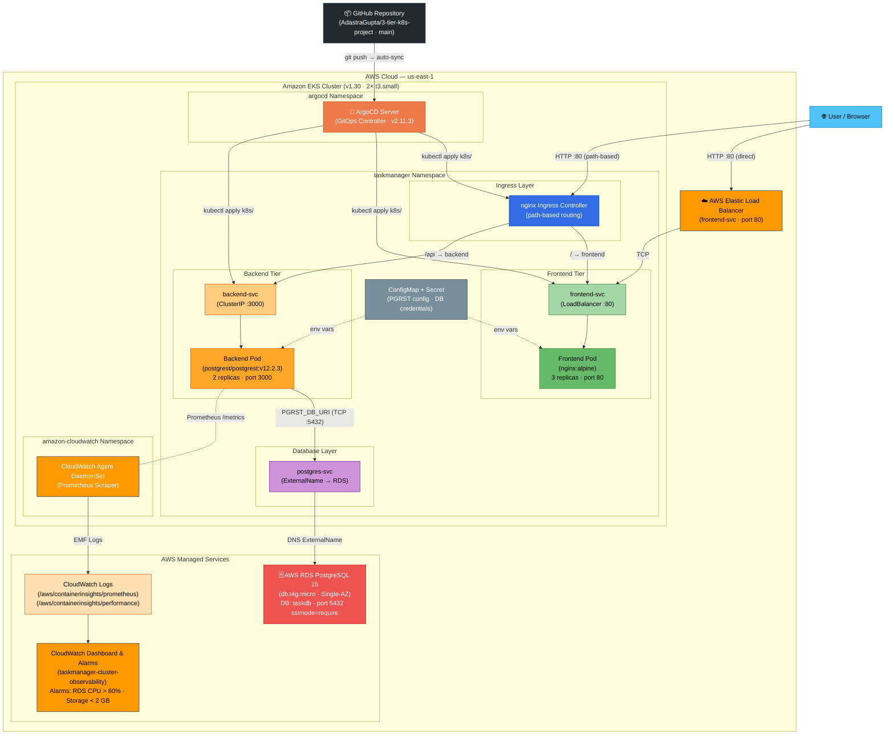

# 3-Tier Task Manager — AWS EKS + GitOps

A production-grade, cloud-native **3-tier task manager** application deployed on **AWS EKS** with a fully automated **GitOps** pipeline using ArgoCD.

## Architecture



## Tech Stack

| Layer | Technology |
|---|---|
| **Container Orchestration** | AWS EKS 1.30 (Managed Node Group, `t3.small`) |
| **Frontend** | Nginx serving static HTML/CSS/JS |
| **Backend API** | [PostgREST](https://postgrest.org/) v12.2.3 — auto-generates REST API from PostgreSQL schema |
| **Database** | AWS RDS PostgreSQL 15 (`db.t4g.micro`, Single-AZ) |
| **GitOps** | ArgoCD v2.11.3 — continuous delivery from this GitHub repository |
| **Observability** | AWS CloudWatch (Dashboard + Metric Alarms) |
| **Infrastructure as Code** | Terraform |
| **Networking** | Native Kubernetes Ingress, ClusterIP, LoadBalancer, ExternalName services |

## Project Structure

```
├── k8s/                        # Kubernetes manifests (synced by ArgoCD)
│   ├── namespace.yaml          # taskmanager namespace
│   ├── secret.yaml             # App secrets (RDS credentials, PGRST_DB_URI)
│   ├── configmap.yaml          # PostgREST configuration (schema, anon role)
│   ├── frontend-configmap.yaml # Frontend HTML/CSS/JS (served via Nginx)
│   ├── frontend-deployment.yaml
│   ├── frontend-service.yaml   # type: LoadBalancer — public internet access
│   ├── backend-deployment.yaml # PostgREST deployment
│   ├── backend-service.yaml    # type: ClusterIP
│   ├── postgres-service.yaml   # type: ExternalName → AWS RDS endpoint
│   ├── ingress.yaml            # Path-based routing (/ → frontend, /api → backend)
│   ├── argocd-namespace.yaml   # ArgoCD namespace
│   └── argocd-app.yaml         # ArgoCD Application manifest
│
└── terraform/                  # Infrastructure as Code
    ├── provider.tf             # AWS + Kubernetes + Helm provider config
    ├── variables.tf            # All configurable inputs
    ├── vpc.tf                  # VPC, public/private subnets, NAT Gateway
    ├── eks.tf                  # EKS cluster + managed node group
    ├── rds.tf                  # RDS PostgreSQL instance + subnet/security groups
    ├── cloudwatch.tf           # CloudWatch Log Groups, Dashboard, Metric Alarms
    └── outputs.tf              # Key outputs (endpoints, commands)
```

## Prerequisites

- AWS CLI configured with appropriate credentials (`aws configure`)
- [Terraform](https://developer.hashicorp.com/terraform/install) >= 1.5
- [kubectl](https://kubernetes.io/docs/tasks/tools/)
- [Helm](https://helm.sh/docs/intro/install/)

## Quick Start

### 1. Deploy Infrastructure

```bash
cd terraform
terraform init
terraform apply
```

This provisions:
- EKS cluster (`taskmanager-cluster`) with 2× `t3.small` worker nodes
- AWS RDS PostgreSQL 15 (`db.t4g.micro`)
- VPC with public/private subnets across 2 AZs
- CloudWatch Dashboard + Metric Alarms

### 2. Configure kubectl

```bash
aws eks update-kubeconfig --region us-east-1 --name taskmanager-cluster
```

### 3. Update RDS Endpoint in postgres-service.yaml

After `terraform apply`, update the `externalName` in [k8s/postgres-service.yaml](k8s/postgres-service.yaml) with the actual RDS endpoint:

```bash
# Get the RDS address
terraform output rds_address

# Or patch it directly
terraform output rds_k8s_external_service_command | bash
```

### 4. Update k8s/secret.yaml with RDS Credentials

Encode your RDS credentials in base64 and update [k8s/secret.yaml](k8s/secret.yaml):

```bash
# Example
echo -n "postgres://postgres:<PASSWORD>@<RDS_HOST>:5432/taskdb?sslmode=require" | base64
```

### 5. Initialize the Database Schema

Run a one-off pod to create the `tasks` table and `web_anon` role on RDS:

```bash
kubectl run rds-init -n taskmanager --image=postgres:15-alpine --rm -i --restart=Never -- \
  psql "postgres://postgres:<PASSWORD>@<RDS_HOST>:5432/taskdb?sslmode=require" -c "
    CREATE ROLE web_anon NOLOGIN;
    GRANT USAGE ON SCHEMA public TO web_anon;
    CREATE TABLE IF NOT EXISTS tasks (
      id SERIAL PRIMARY KEY,
      title VARCHAR(255) NOT NULL,
      description TEXT,
      status VARCHAR(50) NOT NULL DEFAULT 'pending',
      created_at TIMESTAMPTZ DEFAULT NOW(),
      updated_at TIMESTAMPTZ DEFAULT NOW()
    );
    GRANT ALL ON TABLE tasks TO web_anon;
    GRANT USAGE, SELECT ON ALL SEQUENCES IN SCHEMA public TO web_anon;"
```

### 6. Bootstrap ArgoCD (GitOps)

```bash
kubectl apply -f k8s/argocd-namespace.yaml
kubectl apply -n argocd -f https://raw.githubusercontent.com/argoproj/argo-cd/v2.11.3/manifests/install.yaml
kubectl wait --for=condition=available deployment/argocd-server -n argocd --timeout=120s
kubectl apply -f k8s/argocd-app.yaml
```

Get the admin password:
```bash
kubectl -n argocd get secret argocd-initial-admin-secret -o jsonpath="{.data.password}" | base64 -d
```

Access the ArgoCD UI:
```bash
kubectl port-forward svc/argocd-server 8080:443 -n argocd
# Open https://localhost:8080 (user: admin)
```

### 7. Push Changes to GitHub to Sync

Any changes committed and pushed to the `k8s/` directory on the `main` branch will be **automatically synced** by ArgoCD within ~3 minutes.

## Accessing the Application

### Frontend Web UI (LoadBalancer)

```bash
kubectl get svc frontend-svc -n taskmanager
# Use the EXTERNAL-IP / hostname once AWS provisions the Load Balancer (~2 min)
```

Open `http://<EXTERNAL-IP>` in your browser.

### Port-Forward (Development)

```bash
# Frontend
kubectl port-forward svc/frontend-svc 8080:80 -n taskmanager
# Open http://localhost:8080

# Backend REST API
kubectl port-forward svc/backend-svc 3000:3000 -n taskmanager
# Open http://localhost:3000/tasks
```

## Key Design Decisions

| Decision | Rationale |
|---|---|
| **PostgREST as Backend** | Auto-generates a full REST API from PostgreSQL schema — zero backend code to maintain |
| **AWS RDS (not in-cluster Postgres)** | Managed, automated backups, Multi-AZ failover capability, separate lifecycle from EKS |
| **ExternalName Service for RDS** | Backend pods connect via `postgres-svc:5432` — no hardcoded DNS, easy to swap |
| **Native K8s Ingress (no Istio)** | Eliminates sidecar overhead (~100–150 MB RAM/CPU per pod), removes webhook deadlock risk |
| **ArgoCD GitOps** | Git is the single source of truth; all changes are auditable, rollback is a `git revert` |
| **`sslmode=require` in DB URI** | AWS RDS enforces TLS by default; this ensures encrypted connections from PostgREST |
| **`t3.small` nodes** | Sufficient for dev/demo; easily upgraded via `var.node_instance_type` |

## CloudWatch Observability

After deployment, a **CloudWatch Dashboard** is automatically provisioned at:

```bash
terraform output cloudwatch_dashboard_url
```

The dashboard shows:
- **PostgREST API request rate** (Prometheus metrics from `/metrics`)
- **RDS CPU Utilization + DB Connections**
- **EKS Pod CPU & Memory** (Container Insights)

**Metric Alarms** are configured for:
- RDS CPU > 80% for 5 minutes
- RDS Free Storage < 2 GB

## Teardown

```bash
cd terraform
terraform destroy
```

> [!NOTE]
> If the destroy fails on VPC deletion (due to lingering ENIs from the LoadBalancer service), delete the Kubernetes LoadBalancer service first: `kubectl delete svc frontend-svc -n taskmanager`, wait ~60s, then re-run `terraform destroy`.

## Repository

**GitHub**: [https://github.com/AdastraGupta/3-tier-k8s-project](https://github.com/AdastraGupta/3-tier-k8s-project)
