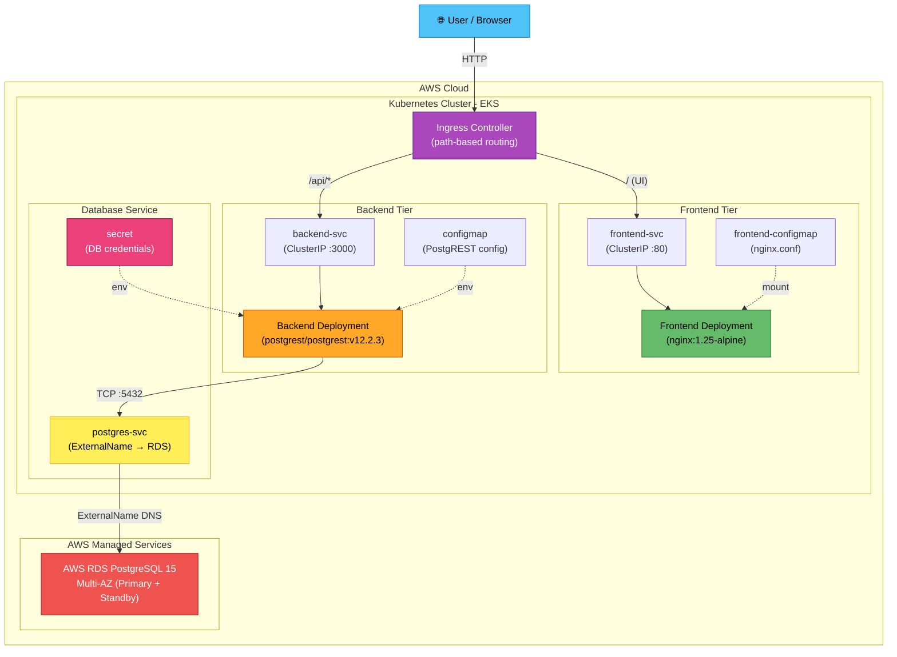
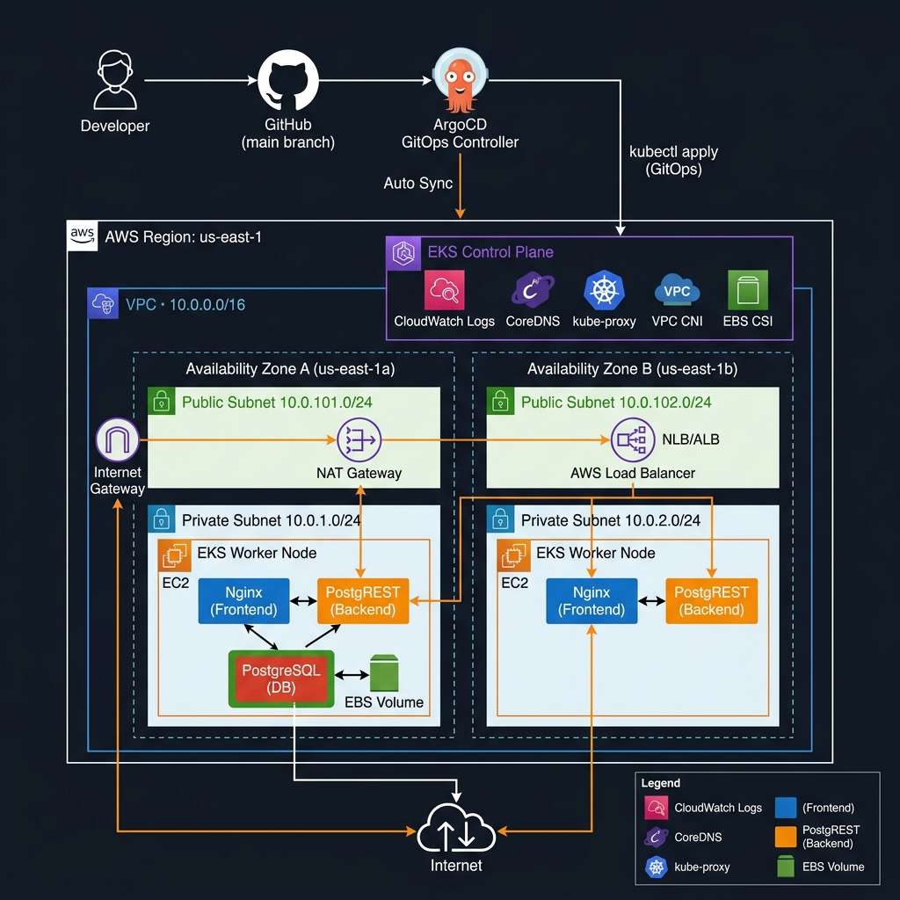

# 3-Tier Kubernetes Task Manager

A cloud-native task management application deployed on Kubernetes, demonstrating production-grade 3-tier architecture with **zero custom application code**. Uses pre-built DockerHub images exclusively — the entire project is pure Kubernetes manifests.

> [!NOTE]
> This project showcases real-world Kubernetes orchestration skills using battle-tested, off-the-shelf container images. No Dockerfiles, no custom builds — just infrastructure as code.

---

## Architecture



### AWS Cloud Architecture (EKS + GitOps)




---

## Tech Stack

| Component      | Image / Tool                    | Purpose                                        |
| -------------- | ------------------------------- | ---------------------------------------------- |
| **Frontend**   | `nginx:1.25-alpine`             | Serves static UI & reverse-proxies API requests |
| **Backend**    | `postgrest/postgrest:v12.2.3`   | Auto-generates REST API from PostgreSQL schema  |
| **Database**   | AWS RDS PostgreSQL 15           | Fully managed relational database (Multi-AZ / Single-AZ) |
| **Service Mesh** | Istio `v1.22.3`               | Zero-trust STRICT mTLS, L7 traffic routing, DestinationRules |
| **Observability** | AWS CloudWatch + Prometheus   | Embedded Metric Format (EMF) logs, Container Insights & Alarms |
| **GitOps**     | ArgoCD `v2.11.3`                | Watches Git and auto-syncs manifests to cluster |
| **IaC**        | Terraform `>= 1.6`              | Provisions AWS VPC, EKS cluster, RDS, Istio Helm, and IAM |
| **Compute**    | EC2 Spot Instances (`t3.medium`) | Reduced node cost by ~70% using AWS Spot capacity |

---

## Prerequisites

| Tool                        | Required | Notes                                      |
| --------------------------- | -------- | ------------------------------------------ |
| Docker                      | ✅        | Container runtime (kind runs K8s in Docker) |
| kubectl                     | ✅        | Kubernetes CLI                             |
| kind                        | ✅        | Local Kubernetes cluster via Docker        |
| Internet access             | ✅        | ArgoCD is installed from GitHub releases   |

---

## Quick Start

```bash
# 1. Run the automated bootstrap script
#    This creates the Kind cluster, installs Nginx Ingress, installs ArgoCD,
#    and bootstraps the ArgoCD Application — all in one command.
bash deploy.sh

# 2. Access the Task Manager app
#    → http://localhost            (via Ingress)
#    → http://localhost:8081       (via port-forward, if port 80 is busy)
#       kubectl port-forward svc/frontend-svc 8081:80 -n taskmanager

# 3. Access the ArgoCD dashboard
#    kubectl port-forward svc/argocd-server 8080:443 -n argocd
#    → https://localhost:8080   (username: admin)
#    Password: kubectl -n argocd get secret argocd-initial-admin-secret \
#              -o jsonpath='{.data.password}' | base64 -d
```

> [!TIP]
> The `deploy.sh` script handles **everything** automatically — cluster creation, Nginx Ingress, ArgoCD installation, and GitOps bootstrap. Just run `bash deploy.sh`!

> [!NOTE]
> After bootstrap, **all future deployments are GitOps**: edit any file in `k8s/`, commit, and push to `main` — ArgoCD will automatically sync the changes to the cluster within minutes.

---

## Project Structure

```
k8s-task-manager/
├── README.md                        # This file
├── deploy.sh                        # Automated bootstrap script (GitOps-aware)
├── kind-config.yaml                 # Kind cluster config with port mappings
├── terraform/                       # Infrastructure as Code for AWS EKS & RDS
│   ├── provider.tf                  # AWS & Kubernetes provider config
│   ├── variables.tf                 # Input variables with sensible defaults
│   ├── vpc.tf                       # VPC, subnets, NAT Gateway
│   ├── eks.tf                       # EKS cluster, node group, add-ons, IRSA
│   ├── rds.tf                       # AWS RDS PostgreSQL (Multi-AZ) database instance
│   └── outputs.tf                   # Cluster endpoint, VPC IDs, RDS endpoints

└── k8s/
    ├── argocd-namespace.yaml        # ArgoCD namespace
    ├── argocd-app.yaml              # ArgoCD Application CR (GitOps config)
    ├── namespace.yaml               # taskmanager namespace
    ├── secret.yaml                  # Database credentials (base64)
    ├── configmap.yaml               # PostgREST / app configuration
    ├── db-init-configmap.yaml       # SQL schema init script (for local Kind dev only)
    ├── postgres-statefulset.yaml    # PostgreSQL StatefulSet (local Kind dev only)
    ├── postgres-service.yaml        # ClusterIP (local) / ExternalName → AWS RDS (prod)
    ├── backend-deployment.yaml      # PostgREST Deployment
    ├── backend-service.yaml         # PostgREST ClusterIP Service
    ├── frontend-configmap.yaml      # Nginx reverse-proxy config + UI
    ├── frontend-deployment.yaml     # Nginx Frontend Deployment
    ├── frontend-service.yaml        # Frontend ClusterIP Service
    └── ingress.yaml                 # Ingress with path-based routing
```

---

## GitOps Workflow

This project uses **ArgoCD** as its GitOps controller. Once bootstrapped, the cluster is
always driven by the state of the `k8s/` directory in the `main` branch — no manual
`kubectl apply` commands are needed.

```
┌─────────────────────────────────────────────────────────────┐
│                     GitOps Loop                             │
│                                                             │
│  1. Developer edits a file in k8s/                          │
│  2. git commit && git push origin main                      │
│  3. ArgoCD detects diff (polls every 3 min)                 │
│  4. ArgoCD applies changed manifests to Kind cluster        │
│  5. Cluster state ≡ Git state  ✅                           │
└─────────────────────────────────────────────────────────────┘
```

### Key ArgoCD Features Enabled

| Feature | Setting | Effect |
|---------|---------|--------|
| **Auto Sync** | `automated: {}` | Syncs automatically when Git changes |
| **Self Heal** | `selfHeal: true` | Reverts any manual `kubectl` changes to match Git |
| **Prune** | `prune: true` | Deletes K8s resources removed from Git |
| **Retry** | `limit: 5` | Retries failed syncs with exponential backoff |

### ArgoCD Dashboard

```bash
# Port-forward the ArgoCD server
kubectl port-forward svc/argocd-server 8080:443 -n argocd

# Get the admin password
kubectl -n argocd get secret argocd-initial-admin-secret \
  -o jsonpath='{.data.password}' | base64 -d

# Open → https://localhost:8080  (username: admin)
```

### Check Sync Status via CLI

```bash
kubectl get application taskmanager -n argocd

# Example output:
# NAME          SYNC STATUS   HEALTH STATUS
# taskmanager   Synced        Healthy
```

---

## AWS EKS Deployment (Terraform)

For production deployment, the `terraform/` directory contains Infrastructure as Code
that provisions a fully production-grade EKS cluster on AWS.

### Prerequisites
- AWS CLI installed and configured (`aws configure`)
- Terraform `>= 1.6.0` installed
- An AWS account with sufficient IAM permissions

### What Terraform Provisions

| Resource | Details |
|---|---|
| **VPC** | Dedicated VPC (`10.0.0.0/16`) with DNS enabled |
| **Subnets** | 2 Public (load balancers) + 2 Private (EKS nodes & RDS) across 2 AZs |
| **NAT Gateway** | Allows private nodes to pull container images |
| **EKS Cluster** | Kubernetes `1.30` control plane |
| **Managed Node Group** | 2x `t3.medium` EC2 instances (auto-scaling 1–3) |
| **AWS RDS PostgreSQL** | Multi-AZ managed PostgreSQL 15 instance with automatic failover & private DB subnet group |
| **EKS Add-ons** | CoreDNS, kube-proxy, VPC CNI, EBS CSI Driver |
| **IAM / IRSA** | IAM roles for EBS CSI driver via OIDC |

### Deploy to EKS & Integrate RDS

```bash
# 1. Initialise Terraform (downloads providers and modules)
cd terraform
terraform init

# 2. Preview what will be created (no charges yet)
terraform plan

# 3. Create the AWS infrastructure including EKS & RDS Multi-AZ (~10-15 minutes)
terraform apply

# 4. Configure kubectl to point to the new EKS cluster
aws eks update-kubeconfig --region us-east-1 --name taskmanager-cluster

# 5. Bootstrap ArgoCD on EKS (same as local setup)
kubectl apply -f k8s/argocd-namespace.yaml
kubectl apply -n argocd -f https://raw.githubusercontent.com/argoproj/argo-cd/v2.11.3/manifests/install.yaml
kubectl wait --for=condition=available deployment/argocd-server -n argocd --timeout=120s
kubectl apply -f k8s/argocd-app.yaml

# 6. (Optional) Route in-cluster postgres-svc to AWS RDS with zero application code changes:
#    Patch the postgres-svc Service to ExternalName:
RDS_ENDPOINT=$(terraform output -raw rds_address)
kubectl patch svc postgres-svc -n taskmanager \
  -p "{\"spec\":{\"type\":\"ExternalName\",\"externalName\":\"$RDS_ENDPOINT\"}}"

# 7. ArgoCD syncs your application from GitHub automatically ✅
```


### Tear Down

> [!WARNING]
> Running `terraform destroy` will delete all AWS resources and is irreversible.

```bash
cd terraform
terraform destroy
```

---

## API Endpoints

PostgREST automatically generates a full REST API from the PostgreSQL schema. All endpoints are accessible under the `/api/` prefix.

### List All Tasks

```bash
curl http://localhost:8080/api/tasks
```

### Filter Tasks by Status

```bash
curl "http://localhost:8080/api/tasks?status=eq.pending"
```

### Create a Task

```bash
curl -X POST http://localhost:8080/api/tasks \
  -H "Content-Type: application/json" \
  -H "Prefer: return=representation" \
  -d '{"title": "Learn Kubernetes", "description": "Complete the K8s task manager project", "status": "pending"}'
```

### Update a Task

```bash
curl -X PATCH "http://localhost:8080/api/tasks?id=eq.1" \
  -H "Content-Type: application/json" \
  -H "Prefer: return=representation" \
  -d '{"status": "completed"}'
```

### Delete a Task

```bash
curl -X DELETE "http://localhost:8080/api/tasks?id=eq.1"
```

> [!IMPORTANT]
> The PostgREST API supports the full range of [PostgREST query syntax](https://postgrest.org/en/stable/references/api.html), including filtering, ordering, pagination, and bulk operations out of the box.

---

## Kubernetes Resources

| #  | Type         | Name                  | Purpose                                      |
| -- | ------------ | --------------------- | -------------------------------------------- |
| 1  | Namespace    | `taskmanager`          | Isolates all project resources                |
| 2  | Secret       | `db-secret`            | Stores database credentials (base64-encoded)  |
| 3  | ConfigMap    | `app-config`           | PostgREST and application configuration       |
| 4  | ConfigMap    | `db-init-config`       | SQL init script for schema & seed data        |
| 5  | ConfigMap    | `frontend-config`      | Nginx reverse-proxy configuration             |
| 6  | StatefulSet  | `postgres`             | PostgreSQL 15 with health probes & dynamic PVC|
| 7  | Service      | `postgres-svc`         | Internal ClusterIP for database access        |
| 8  | Deployment   | `backend`              | PostgREST auto-generated REST API             |
| 9  | Service      | `backend-svc`          | Internal ClusterIP for API access             |
| 10 | Deployment   | `frontend`             | Nginx serving UI + reverse proxy              |
| 11 | Service      | `frontend-svc`         | Internal ClusterIP for frontend access        |
| 12 | Ingress      | `taskmanager-ingress`  | Path-based routing (`/` → UI, `/api` → API)  |

---

## Cleanup

Remove all resources by deleting the namespace:

```bash
kubectl delete namespace taskmanager
```

Or use the deploy script:

```bash
# Remove app resources only (keeps the cluster)
bash deploy.sh --cleanup

# Delete the entire kind cluster
bash deploy.sh --destroy
# or
kind delete cluster --name taskmanager
```

---

## Skills Demonstrated

- **3-Tier Microservices Architecture** — Frontend, Backend API, and Database as independently deployable units
- **Kubernetes Orchestration** — Deployments, Services, Ingress, and Namespaces
- **Configuration Management** — Externalized config via ConfigMaps and Secrets
- **Persistent Storage** — PersistentVolumeClaims for stateful database workloads
- **Service Discovery & Internal Networking** — DNS-based inter-service communication
- **Ingress & Path-based Routing** — Single entry point with intelligent request routing
- **Health Probes (Liveness / Readiness)** — Automated pod health management
- **Resource Management** — CPU and memory requests/limits for every container
- **Infrastructure as Code** — Entire stack defined as declarative YAML manifests
- **12-Factor App Principles** — Config in environment, stateless processes, port binding
- **GitOps (ArgoCD)** — Git as the single source of truth; automated sync, self-healing, and drift detection
- **Cloud Infrastructure (Terraform + AWS EKS)** — Production-grade cluster on AWS with VPC, managed node groups, and IRSA
- **Service Mesh (Istio)** — Zero-trust mTLS encryption, L7 traffic management, retry/timeout resilience, and DestinationRule circuit breaking
- **Cloud Observability (AWS CloudWatch + Prometheus)** — Container Insights, Embedded Metric Format (EMF) log stream ingestion, unified dashboards, and metric alarms
- **AWS Cost Optimization** — EC2 Spot instance capacity, single-AZ DB option, and right-sized compute nodes for non-prod savings (~70% savings)

---

## Service Mesh & Observability

### Istio Service Mesh (PROD / AWS EKS)

The project incorporates **Istio Service Mesh** installed declaratively via Terraform Helm releases (`istio-base`, `istiod`, `istio-ingressgateway`):

- **Zero-Trust Security**: `PeerAuthentication` enforces `STRICT` mutual TLS (mTLS) across all pods in `taskmanager`.
- **Fine-Grained Authorization**: `AuthorizationPolicy` resources restrict network traffic using SPIFFE identities (`frontend-sa`, `backend-sa`, `postgres-sa`). Only `backend-sa` is authorized to access `postgres-svc:5432`.
- **Traffic Management**: Istio `Gateway` & `VirtualService` handle path-based routing (`/` → frontend, `/api` → backend with `/api` prefix stripping), 3x retry policies, and per-route timeouts.
- **Circuit Breaking**: `DestinationRule` resources configure connection pool limits and 5xx error outlier detection for fault tolerance.

### AWS CloudWatch Observability (Pattern 1)

Monitoring is powered by the **Amazon CloudWatch Observability EKS Add-on**:

- **Prometheus Metric Ingestion**: Scrapes `/metrics` from annotated pods (`prometheus.io/scrape: "true"`) and streams metrics as Embedded Metric Format (EMF) logs to `/aws/containerinsights/taskmanager-cluster/prometheus`.
- **Unified CloudWatch Dashboard**: Realtime 6-widget dashboard displaying PostgREST API request rates, Istio Ingress request volume, EKS pod CPU/memory utilization, and RDS PostgreSQL performance.
- **CloudWatch Metric Alarms**: Automated alerts for RDS High CPU (>80%), Low Storage (<5GB), Backend 5xx HTTP Errors, and Pod Memory Saturation (>85%).


---

## License

This project is open source and available under the [MIT License](LICENSE).
