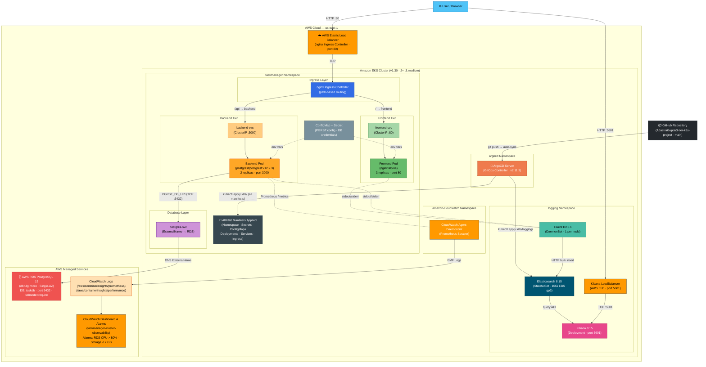

# 3-Tier Task Manager — AWS EKS + GitOps

A production-grade, cloud-native **3-tier task manager** application deployed on **AWS EKS** with a fully automated **GitOps** pipeline using ArgoCD.

## Architecture



## Tech Stack

| Layer | Technology |
|---|---|
| **Container Orchestration** | AWS EKS 1.30 (Managed Node Group, `t3.medium`) |
| **Frontend** | Nginx serving static HTML/CSS/JS |
| **Backend API** | [PostgREST](https://postgrest.org/) v12.2.3 — auto-generates REST API from PostgreSQL schema |
| **Database** | AWS RDS PostgreSQL 15 (`db.t4g.micro`, Single-AZ) |
| **GitOps** | ArgoCD v2.11.3 — continuous delivery from this GitHub repository |
| **CI/CD** | GitHub Actions — Terraform plan/apply pipeline with OIDC authentication |
| **Observability** | AWS CloudWatch (Dashboard + Metric Alarms) |
| **Centralized Logging** | EFK Stack — Elasticsearch 8.15, Fluent Bit 3.1, Kibana 8.15 (Helm-managed via Terraform) |
| **Infrastructure as Code** | Terraform (S3 backend + DynamoDB state locking) |
| **Networking** | Native Kubernetes Ingress (nginx), ClusterIP, ExternalName services |

## Project Structure

```
├── k8s/                              # Kubernetes manifests (synced by ArgoCD)
│   ├── namespace.yaml                # taskmanager namespace
│   ├── secret.yaml                   # App secrets (RDS credentials, PGRST_DB_URI)
│   ├── configmap.yaml                # PostgREST configuration (schema, anon role)
│   ├── frontend-configmap.yaml       # Frontend HTML/CSS/JS (served via Nginx)
│   ├── frontend-deployment.yaml
│   ├── frontend-service.yaml         # type: ClusterIP — traffic enters via nginx Ingress only
│   ├── backend-deployment.yaml       # PostgREST deployment
│   ├── backend-service.yaml          # type: ClusterIP
│   ├── postgres-service.yaml         # type: ExternalName → AWS RDS endpoint
│   ├── ingress.yaml                  # Path-based routing (/ → frontend, /api → backend)
│   ├── argocd-namespace.yaml         # ArgoCD namespace
│   └── argocd-app.yaml               # ArgoCD Application manifest (taskmanager)
│
└── terraform/                        # Infrastructure as Code
    ├── provider.tf                   # AWS + Kubernetes + Helm provider config
    ├── variables.tf                  # All configurable inputs (incl. EFK vars)
    ├── vpc.tf                        # VPC, public/private subnets, NAT Gateway
    ├── eks.tf                        # EKS cluster + managed node group + EBS CSI
    ├── rds.tf                        # RDS PostgreSQL instance + subnet/security groups
    ├── cloudwatch.tf                 # CloudWatch Log Groups, Dashboard, Metric Alarms
    ├── efk.tf                        # EFK logging stack (Helm: ES + Fluent Bit + Kibana)
    └── outputs.tf                    # Key outputs (endpoints, commands, EFK)
├── .github/
│   └── workflows/
│       └── terraform.yml             # CI/CD: plan on PR, auto-apply on push to main
```

## Prerequisites

- AWS CLI configured with appropriate credentials (`aws configure`)
- [Terraform](https://developer.hashicorp.com/terraform/install) >= 1.5
- [kubectl](https://kubernetes.io/docs/tasks/tools/)
- [Helm](https://helm.sh/docs/intro/install/)

## Quick Start

### 1. Deploy Infrastructure

```bash
cd terraform
terraform init
terraform apply
```

This provisions:
- EKS cluster (`taskmanager-cluster`) with 2× `t3.medium` worker nodes
- AWS RDS PostgreSQL 15 (`db.t4g.micro`)
- VPC with public/private subnets across 2 AZs
- CloudWatch Dashboard + Metric Alarms
- **EFK Logging Stack** via Helm (Elasticsearch, Fluent Bit, Kibana)

### 2. Configure kubectl

```bash
aws eks update-kubeconfig --region us-east-1 --name taskmanager-cluster
```

### 3. Update RDS Endpoint in postgres-service.yaml

After `terraform apply`, update the `externalName` in [k8s/postgres-service.yaml](k8s/postgres-service.yaml) with the actual RDS endpoint:

```bash
# Get the RDS address
terraform output rds_address

# Or patch it directly
terraform output rds_k8s_external_service_command | bash
```

### 4. Update k8s/secret.yaml with RDS Credentials

Encode your RDS credentials in base64 and update [k8s/secret.yaml](k8s/secret.yaml):

```bash
# Example
echo -n "postgres://postgres:<PASSWORD>@<RDS_HOST>:5432/taskdb?sslmode=require" | base64
```

### 5. Initialize the Database Schema

Run a one-off pod to create the `tasks` table and `web_anon` role on RDS:

```bash
kubectl run rds-init -n taskmanager --image=postgres:15-alpine --rm -i --restart=Never -- \
  psql "postgres://postgres:<PASSWORD>@<RDS_HOST>:5432/taskdb?sslmode=require" -c "
    CREATE ROLE web_anon NOLOGIN;
    GRANT USAGE ON SCHEMA public TO web_anon;
    CREATE TABLE IF NOT EXISTS tasks (
      id SERIAL PRIMARY KEY,
      title VARCHAR(255) NOT NULL,
      description TEXT,
      status VARCHAR(50) NOT NULL DEFAULT 'pending',
      created_at TIMESTAMPTZ DEFAULT NOW(),
      updated_at TIMESTAMPTZ DEFAULT NOW()
    );
    GRANT ALL ON TABLE tasks TO web_anon;
    GRANT USAGE, SELECT ON ALL SEQUENCES IN SCHEMA public TO web_anon;"
```

### 6. Bootstrap ArgoCD (GitOps)

```bash
kubectl apply -f k8s/argocd-namespace.yaml
kubectl apply -n argocd -f https://raw.githubusercontent.com/argoproj/argo-cd/v2.11.3/manifests/install.yaml
kubectl wait --for=condition=available deployment/argocd-server -n argocd --timeout=120s
kubectl apply -f k8s/argocd-app.yaml
```

Get the admin password:
```bash
kubectl -n argocd get secret argocd-initial-admin-secret -o jsonpath="{.data.password}" | base64 -d
```

Access the ArgoCD UI:
```bash
kubectl port-forward svc/argocd-server 8080:443 -n argocd
# Open https://localhost:8080 (user: admin)
```

### 7. Push Changes to GitHub to Sync

Any changes committed and pushed to the `k8s/` directory on the `main` branch will be **automatically synced** by ArgoCD within ~3 minutes.

## Accessing the Application

### Frontend Web UI (via nginx Ingress)

```bash
# Get the nginx Ingress Controller's external hostname (single public ELB)
kubectl get svc -n ingress-nginx ingress-nginx-controller
# Use the EXTERNAL-IP once AWS provisions the Load Balancer (~2 min)
```

Open `http://<EXTERNAL-IP>/` in your browser.

For the REST API: `http://<EXTERNAL-IP>/api/tasks`

### Port-Forward (Development)

```bash
# Frontend
kubectl port-forward svc/frontend-svc 8080:80 -n taskmanager
# Open http://localhost:8080

# Backend REST API
kubectl port-forward svc/backend-svc 3000:3000 -n taskmanager
# Open http://localhost:3000/tasks
```

## Key Design Decisions

| Decision | Rationale |
|---|---|
| **PostgREST as Backend** | Auto-generates a full REST API from PostgreSQL schema — zero backend code to maintain |
| **AWS RDS (not in-cluster Postgres)** | Managed, automated backups, Multi-AZ failover capability, separate lifecycle from EKS |
| **ExternalName Service for RDS** | Backend pods connect via `postgres-svc:5432` — no hardcoded DNS, easy to swap |
| **Native K8s Ingress (no Istio)** | Eliminates sidecar overhead (~100–150 MB RAM/CPU per pod), removes webhook deadlock risk |
| **ArgoCD GitOps** | Git is the single source of truth; all changes are auditable, rollback is a `git revert` |
| **`sslmode=require` in DB URI** | AWS RDS enforces TLS by default; this ensures encrypted connections from PostgREST |
| **`t3.medium` nodes** | Required for EFK stack (~2–3 GB RAM); configurable via `var.node_instance_type` |
| **EFK via Helm (not raw YAML)** | Official Helm charts (elastic/elasticsearch, fluent/fluent-bit, elastic/kibana) — production-grade with upgradeable chart versions, parameterized via Terraform variables |

## CloudWatch Observability

After deployment, a **CloudWatch Dashboard** is automatically provisioned at:

```bash
terraform output cloudwatch_dashboard_url
```

The dashboard shows:
- **PostgREST API request rate** (Prometheus metrics from `/metrics`)
- **RDS CPU Utilization + DB Connections**
- **EKS Pod CPU & Memory** (Container Insights)

**Metric Alarms** are configured for:
- RDS CPU > 80% for 5 minutes
- RDS Free Storage < 2 GB

## EFK Centralized Logging

The project includes a full **EFK stack** (Elasticsearch, Fluent Bit, Kibana) for centralized log aggregation, search, and visualization — deployed via **official Helm charts** managed by Terraform.

### Architecture

```
┌──────────────┐     ┌──────────────┐     ┌──────────────┐
│  Frontend    │     │  Backend     │     │  System Pods │
│  (nginx)     │     │  (PostgREST) │     │  (kube-*, ..)│
│  stdout/err  │     │  stdout/err  │     │  stdout/err  │
└──────┬───────┘     └──────┬───────┘     └──────┬───────┘
       │                    │                    │
       └────────────┬───────┘────────────────────┘
                    │
         ┌──────────▼──────────┐
         │    Fluent Bit 3.1   │  ← Helm: fluent/fluent-bit
         │  /var/log/containers│  ← DaemonSet (1 per node)
         │  + K8s metadata     │  ← Enriches with pod/ns/labels
         └──────────┬──────────┘
                    │ HTTP bulk insert
         ┌──────────▼──────────┐
         │  Elasticsearch 8.15 │  ← Helm: elastic/elasticsearch
         │  Index: fluent-bit-*│  ← StatefulSet (10Gi EBS gp3)
         └──────────┬──────────┘
                    │ Query API
         ┌──────────▼──────────┐
         │    Kibana 8.15      │  ← Helm: elastic/kibana
         │  LoadBalancer :5601 │  ← AWS ELB
         └─────────────────────┘
```

### Helm Charts Used

| Component | Chart | Repository | Image Tag |
|---|---|---|---|
| **Elasticsearch** | `elastic/elasticsearch` v8.5.1 | `https://helm.elastic.co` | `8.15.0` |
| **Fluent Bit** | `fluent/fluent-bit` v0.47.10 | `https://fluent.github.io/helm-charts` | latest |
| **Kibana** | `elastic/kibana` v8.5.1 | `https://helm.elastic.co` | `8.15.0` |

### Deployment

The EFK stack is **automatically deployed** by Terraform via `helm_release` resources in [`efk.tf`](terraform/efk.tf):

```bash
cd terraform
terraform init    # Downloads Helm chart providers
terraform apply   # Deploys EFK stack along with all other infrastructure
```

Verify the deployment:
```bash
# Check Helm releases
helm list -n logging

# Wait for all EFK pods to be Running
kubectl get pods -n logging -w

# Check Elasticsearch cluster health
kubectl exec -n logging elasticsearch-master-0 -- curl -s http://localhost:9200/_cluster/health?pretty
```

To **disable** the EFK stack without removing it from code:
```bash
terraform apply -var="efk_enabled=false"
```

### Access Kibana

Kibana is exposed via an **AWS LoadBalancer** on port 5601:

```bash
# Get the Kibana LoadBalancer URL (wait ~2 min for ELB provisioning)
kubectl get svc kibana-kibana -n logging
# Open http://<EXTERNAL-IP>:5601 in your browser
```

Alternatively, use port-forward for local access:
```bash
kubectl port-forward svc/kibana-kibana 5601:5601 -n logging
# Open http://localhost:5601
```

### First-Time Kibana Setup

1. Open Kibana in your browser
2. Go to **Stack Management** → **Data Views** (or Index Patterns)
3. Create a new data view with pattern: `fluent-bit-*`
4. Set the time field to `@timestamp`
5. Navigate to **Discover** to explore logs
6. Use KQL queries to filter:
   - `kubernetes.namespace_name: "taskmanager"` — app logs only
   - `kubernetes.labels.tier: "backend"` — PostgREST logs
   - `kubernetes.labels.tier: "frontend"` — nginx access logs
   - `kubernetes.pod_name: "backend-*" AND log: "error"` — backend errors

### Log Retention

Elasticsearch indices follow the pattern `fluent-bit-YYYY.MM.DD` (daily rotation). To manage storage:

```bash
# List all indices and their sizes
kubectl exec -n logging elasticsearch-master-0 -- curl -s 'http://localhost:9200/_cat/indices/fluent-bit-*?v&s=index'

# Delete indices older than 7 days
kubectl exec -n logging elasticsearch-master-0 -- curl -s -X DELETE 'http://localhost:9200/fluent-bit-2024.01.0*'
```

### Helm Upgrade

To upgrade chart versions, update the `version` and `imageTag` in [`efk.tf`](terraform/efk.tf) and re-apply:
```bash
terraform apply   # Helm handles rolling update automatically
```

> [!NOTE]
> For automated index lifecycle management (ILM), configure an ILM policy in Kibana under **Stack Management → Index Lifecycle Policies**.

## CI/CD Pipeline

Infrastructure changes are deployed via a **GitHub Actions** workflow ([`.github/workflows/terraform.yml`](.github/workflows/terraform.yml)).

### Pipeline Flow

```
┌──────────────────┐     ┌──────────────────┐     ┌──────────────────┐
│  Pull Request     │     │  Push to main     │     │  Manual Trigger  │
│  (terraform/**)   │     │  (terraform/**)   │     │  (workflow_disp) │
└────────┬─────────┘     └────────┬─────────┘     └────────┬─────────┘
         │                      │                      │
         v                      v                      v
  ┌─────────────────────────────────────────────────────┐
  │  Job 1: Format Check (terraform fmt -check)          │
  │  Job 2: Init → Validate → Plan (+ PR comment)        │
  └─────────────────────────┬───────────────────────────┘
                          │
            ┌─────────────┼─────────────┐
            v                          v
    ┌─────────────────┐     ┌─────────────────┐
    │  Job 3: Apply   │     │  Job 4: Destroy  │
    │  (push/manual)  │     │  (manual only)   │
    └─────────────────┘     └─────────────────┘
```

| Trigger | What Happens |
|---|---|
| **PR to `main`** | Format → Plan → post plan diff as PR comment (no apply) |
| **Push to `main`** | Format → Plan → **auto-apply** (deploys infrastructure) |
| **Manual: `plan`** | Format → Plan only (dry-run for any environment) |
| **Manual: `apply`** | Format → Plan → Apply (with GitHub Environment approval gate) |
| **Manual: `destroy`** | Format → Plan → Destroy (cleans up LB ENIs first) |

### Security

- **AWS OIDC** — No static access keys. GitHub Actions authenticates to AWS via OpenID Connect federation
- **S3 + DynamoDB** — Terraform state is encrypted at rest in S3 with DynamoDB-based locking to prevent concurrent applies
- **GitHub Environments** — Apply and destroy jobs require environment approval (configurable per environment)
- **Sensitive masking** — `db_password` injected via `${{ secrets.TF_VAR_db_password }}`, never logged

### Setup Prerequisites

#### 1. Create the S3 Backend Resources (One-Time)

```bash
# Create S3 bucket for Terraform state
aws s3api create-bucket \
  --bucket your-tf-state-bucket \
  --region us-east-1

aws s3api put-bucket-versioning \
  --bucket your-tf-state-bucket \
  --versioning-configuration Status=Enabled

aws s3api put-bucket-encryption \
  --bucket your-tf-state-bucket \
  --server-side-encryption-configuration '{"Rules":[{"ApplyServerSideEncryptionByDefault":{"SSEAlgorithm":"AES256"}}]}'

# Create DynamoDB table for state locking
aws dynamodb create-table \
  --table-name terraform-state-lock \
  --attribute-definitions AttributeName=LockID,AttributeType=S \
  --key-schema AttributeName=LockID,KeyType=HASH \
  --billing-mode PAY_PER_REQUEST
```

#### 2. Create an IAM OIDC Role for GitHub Actions

```bash
# Create OIDC identity provider (one-time per AWS account)
aws iam create-open-id-connect-provider \
  --url https://token.actions.githubusercontent.com \
  --thumbprint-list 6938fd4d98bab03faadb97b34396831e3780aea1 \
  --client-id-list sts.amazonaws.com
```

Create a trust policy (`trust-policy.json`) and IAM role with the necessary permissions for EKS, RDS, VPC, CloudWatch, and Helm.

#### 3. Configure GitHub Repository Settings

**Secrets** (Settings → Secrets → Actions):
| Secret | Value | Description |
|---|---|---|
| `AWS_ROLE_ARN` | `arn:aws:iam::123456789012:role/github-actions-terraform` | IAM Role ARN for OIDC federation |
| `TF_VAR_db_password` | Your RDS master password | Injected securely for RDS / PostgREST |
| `TEAMS_WEBHOOK_URL` | *(Optional)* `https://outlook.office.com/webhook/...` | MS Teams Incoming Webhook for CI/CD alerts |

**Variables** (Settings → Variables → Actions):
| Variable | Value |
|---|---|
| `AWS_REGION` | `us-east-1` |
| `TF_STATE_BUCKET` | `your-tf-state-bucket` |
| `TF_STATE_LOCK_TABLE` | `terraform-state-lock` |

## Teardown

Via GitHub Actions (recommended):
```bash
# Trigger a destroy via the Actions tab → "Terraform — Infrastructure CI/CD" → Run workflow → action: destroy
```

Or manually:
```bash
cd terraform
terraform destroy
```

> [!NOTE]
> The GitHub Actions destroy job automatically cleans up LoadBalancer services before destroying the VPC, preventing ENI-related failures.

## Repository

**GitHub**: [https://github.com/AdastraGupta/3-tier-k8s-project](https://github.com/AdastraGupta/3-tier-k8s-project)
